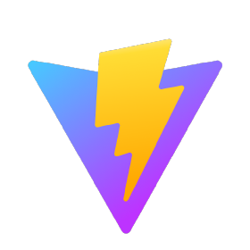

# MERN Blog App

### Table of Contents

- [Prerequisites](#Prerequisites)
- [Technologies Used](#Technologies-Used)
- [Getting Started](#Getting-Started)
- [Author](#Author)

#

### Prerequisites

-  _npm
-  _vite

#

### Technologies Used

-  _react
-  _nodeJS
-  _express
-  _mongoDB


#

### Getting Started

1. First of all you need to clone the app repository from GitHub:

```
git clone https://github.com/otonebieridze/MERN-blog-app.git
```

2. Navigate to the project directory:

```
cd MERN-blog-app
```

3. Install the dependencies for both the server and client:

```
cd server && npm install
cd ../client && npm install
```

4. To see the project in action

```
npm run dev
```

#

### Author

- [LinkedIn](https://www.linkedin.com/in/oto-nebieridze-8aa504219/)
